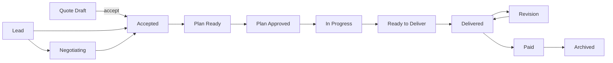

<div align="center">
  <h1>gig</h1>
  <p>本地优先的自由职业 Order 生命周期管理 CLI 与只读 Web 看板。</p>
  <p>
    
    
    
    <a href="LICENSE"></a>
  </p>
</div>

`gig` 把 Quote Draft、Order、Workflow Gate、安全交付和收款归档放在一个可审计的本地流程中。业务数据保存在 SQLite；CLI 适合日常操作与自动化，GUI 提供带进程级 token 的 localhost 只读视图。

[快速开始](#快速开始) · [工作流](#生命周期与工作流) · [安全交付](#client-package-安全门禁) · [命令索引](#命令索引) · [配置](#配置与本地数据)

## 核心能力

- **全生命周期记录** — 从 Quote Draft、线索、沟通和定价，一直到交付、收款与归档。
- **明确的 Workflow Gate** — 计划、开工、验收和 Client Package 必须按顺序通过，不靠隐含状态猜测。
- **安全交付** — 严格校验 manifest、ZIP 内容、软链接和内部文件路径，再允许上传。
- **本地优先** — SQLite、配置、模板和备份均遵循 XDG 目录；不配置上传器也能完成本地管理。
- **人机两套输出** — 表格适合终端使用，`--json` 适合 workflow 和 agent 集成。
- **只读本地 GUI** — 仅绑定 `127.0.0.1`，使用随机 Bearer token，并通过只读 SQLite 连接查询。

## 安装

### 要求

- Rust 1.91.1（仓库通过 `rust-toolchain.toml` 固定）
- Git
- S3 兼容对象存储仅在发送 Client Package 或 Delivery Artifact 时需要

从源码安装：

```bash
git clone https://github.com/jczhang02/gig.git
cd gig
cargo install --locked --path crates/gig-cli
gig --version
```

### Zsh completion

```bash
mkdir -p ~/.local/share/zsh/site-functions
gig completion zsh > ~/.local/share/zsh/site-functions/_gig
```

确保该目录位于 `fpath`，然后刷新 completion：

```zsh
autoload -Uz compinit && compinit
```

## 快速开始

先设置项目和归档目录。未配置时，默认值分别是 `$HOME/dev` 与 `$HOME/Documents/gig-archive`。

```bash
gig config set general.dev_root "$HOME/dev/partjobs"
gig config set general.archive_root "$HOME/Documents/gig-archive"
```

下面是一条完整的 Quote Draft → Order → Client Package 路径：

```bash
# 1. 记录、定价并标记 Quote Draft 已发送
gig quote new --slug crawler-a --title "数据爬虫" --project-type crawler --summary "采集公开列表并导出 CSV"
gig quote price crawler-a --min 3000 --recommended 5000 --max 8000
gig quote mark-sent crawler-a

# 2. 外部 workflow 准备正式项目及 .gig/JOB.md、.gig/QUOTE.md、.gig/INDEX.html 后，接受报价
project_dir="$HOME/dev/partjobs/crawler-a"
gig quote accept crawler-a --project-dir "$project_dir"

# 3. 外部 workflow 准备计划与验收文件；gig 逐个校验 Workflow Gate
gig plan ready crawler-a
gig plan approve crawler-a
gig work start crawler-a
gig acceptance check crawler-a
gig acceptance complete crawler-a

# 4. 外部 workflow 准备交付目录；先检查，再用已配置的 uploader 发送
delivery_dir="$project_dir/.gig/delivery/2026-05-27"
gig package check crawler-a --delivery-date 2026-05-27 --delivery-dir "$delivery_dir"
gig package send crawler-a --delivery-date 2026-05-27 --delivery-dir "$delivery_dir"

# 5. 收款与归档
gig paid crawler-a
gig archive crawler-a
```

> [!IMPORTANT]
> `gig` 不生成 JOB、QUOTE、PLAN、ACCEPTANCE 或交付文件。外部 workflow 负责创建内容，`gig` 负责登记路径、校验门禁、保存状态与执行安全上传。

如果只想先记录一个线索，可以从轻量路径开始：

```bash
gig new --lead --title "某公司官网重做" --slug website-redesign --quoted-price 5000
gig lead promote website-redesign
gig note website-redesign "客户要求响应式设计"
```

## 生命周期与工作流



除终态外，Order 可转为 `cancelled`。计划被拒绝时回到 `accepted`；Revision 完成后重新检查并发送 Client Package，再回到 `delivered`。

### 领域对象

| 对象 | 含义 |
| --- | --- |
| **Quote Draft** | 接受前的范围与价格记录；接受后最多关联一个 Order |
| **Order** | 正式工作的生命周期聚合，包含价格、来源、状态、路径和时间戳 |
| **Workflow Gate** | 计划、开工、验收、Client Package 等显式推进条件 |
| **Client Package** | 归属于一个 Order 的客户交付包，先 `validated`，后 `sent` |
| **Delivery Artifact** | 归属于一个 Order 的上传记录，可以来自 Client Package 或独立文件 |
| **Short Link** | 可选的短链接，重定向到有时效的对象存储下载 URL |

### 外部 workflow 文件约定

Quote Draft 被接受后，`gig` 记录以下预期路径；相应 Workflow Gate 会在推进时检查文件：

```text
<project>/
└── .gig/
    ├── JOB.md
    ├── QUOTE.md
    ├── INDEX.html
    ├── plan/
    │   ├── PLAN.md
    │   └── PLAN.html
    ├── acceptance/
    │   └── ACCEPTANCE.md
    └── delivery/<YYYY-MM-DD>/
        ├── DELIVERY.md
        ├── manifest.toml
        ├── internal/
        │   └── DELIVERY_INTERNAL.html
        ├── client/
        │   ├── DELIVERY_CLIENT.html
        │   └── DELIVERY_CLIENT.pdf
        └── export/
            └── client-package.zip
```

`ACCEPTANCE.md` 必须包含“验收项 / 方法 / 证据 / 结论”（或对应英文）表格，并且每一项都有通过类结论。

## Client Package 安全门禁

`gig package check` 会验证现有交付目录并记录一个 `validated` Client Package；它不会替外部 workflow 创建 ZIP。最小 manifest：

```toml
version = 1
delivery_date = "2026-05-27"
client_files = [
  "DELIVERY_CLIENT.html",
  "DELIVERY_CLIENT.pdf",
  "deliverables/result.csv",
]
```

检查内容包括：

- Client Package 日期与 manifest 一致；
- `client_files` 全部位于 `client/` 内，且都是普通文件；
- ZIP 条目与 allowlist 一致，没有额外文件；
- 拒绝绝对路径、`..`、软链接、隐藏路径和反斜杠路径；
- 拒绝 `internal`、`prompts`、`ACCEPTANCE.md`、`DELIVERY_INTERNAL.html` 等内部材料。

> [!WARNING]
> `gig package send` 只接受同一 Order、日期和 ZIP 路径上已验证的 Client Package。发送前会再次完整校验；上传成功后才记录 Delivery Artifact，并把 Order 推进到 `delivered`。

上传临时附件但不改变 Order 状态时，使用：

```bash
gig artifact send crawler-a report.pdf screenshot.png
```

## 命令索引

| 场景 | 命令 |
| --- | --- |
| Quote Draft | `quote new/show/list/price/mark-sent/accept/drop` |
| Workflow Gate | `plan ready/approve/reject`、`work start`、`acceptance check/complete` |
| 安全交付 | `package check/send`、`artifact send` |
| Order 管理 | `new`、`ls`、`show`、`status`、`delete` |
| 过程记录 | `price`、`change`、`note`、`tag`、`cut` |
| 线索与关系 | `lead`、`client`、`source` |
| 完结 | `paid`、`archive` |
| 数据与维护 | `stats`、`export`、`import`、`doctor`、`backup` |
| 本地界面 | `gui`、`serve` |
| 工具 | `config`、`template`、`completion` |

常用查询：

```bash
gig ls
gig ls --all
gig ls --status in_progress
gig ls --json
gig show crawler-a
gig show crawler-a --json
gig stats
gig doctor
gig backup
```

在已登记项目目录内，许多 Order 命令可以省略 ID；`gig` 会选择路径匹配最深的 Order。查看完整参数请运行 `gig help <command>`。

> [!NOTE]
> 旧 Order 即使没有 Workflow metadata，仍可执行 `ls`、`show`、`export` 和 `archive`。机器可读输出会把需要新门禁的下一步标为 `legacy_workflow_metadata_missing`。

## 本地 GUI

```bash
gig gui
gig gui --no-open
```

`gig gui` 只绑定随机的 `127.0.0.1` 端口。默认自动打开带一次性进程 token 的浏览器 URL；`--no-open` 会打印 URL 与 token。Dashboard、Order、action metadata 和脱敏配置均通过 `gig-core` 的只读 action layer 获取；mutation、外部 I/O 与危险 action 不会执行。

查看某个 Order 已登记的 `.gig/INDEX.html` 与同目录静态文件：

```bash
gig serve crawler-a --open
```

## 配置与本地数据

运行 `gig config edit` 创建默认配置并用 `$EDITOR` 打开。普通字段也可用 `gig config get` 和 `gig config set` 管理。

### S3 兼容交付

```toml
[delivery]
default_uploader = "s3:aliyun-hk"

[delivery.s3.aliyun-hk]
bucket = "my-bucket"
region = "cn-hongkong"
endpoint = "https://s3.oss-cn-hongkong.aliyuncs.com"
access_key = "..."
secret_key = "..."
link_ttl_seconds = 604800
path_style = false

# 可选：把有时效的对象存储 URL 包装成 Short Link
[delivery.short_link]
enabled = true
endpoint = "https://example.com/api/links"
token = "..."
```

> [!CAUTION]
> 配置文件包含对象存储和 Short Link 凭据。Unix 下 `gig` 会把 XDG 目录设为 `0700`、配置文件设为 `0600`；仍应避免提交、同步或展示该文件。

### XDG 路径

| 内容 | 默认位置 |
| --- | --- |
| SQLite 数据库 | `$XDG_DATA_HOME/gig/gig.db`，回退到 `~/.local/share/gig/gig.db` |
| Quote Draft 路径与模板 | `$XDG_DATA_HOME/gig/quotes`、`$XDG_DATA_HOME/gig/templates` |
| 配置 | `$XDG_CONFIG_HOME/gig/config.toml`，回退到 `~/.config/gig/config.toml` |
| 数据库备份 | `$XDG_STATE_HOME/gig/backups`，回退到 `~/.local/state/gig/backups` |

## 开发

工作区由三个 crate 构成：

| Crate | 职责 |
| --- | --- |
| `gig-core` | SQLite schema、领域模型、repository、Workflow Gate、交付与 action layer |
| `gig-cli` | Clap 命令、终端/JSON 输出和命令分发 |
| `gig-gui` | Axum localhost GUI、Bearer token 校验与静态 workflow 文件服务 |

```bash
cargo fmt --all -- --check
cargo clippy --workspace --all-targets -- -D warnings
cargo test --workspace
```

核心层不依赖 CLI 或 GUI；新增行为应先进入 `gig-core`，再由终端或 Web 适配层调用。
